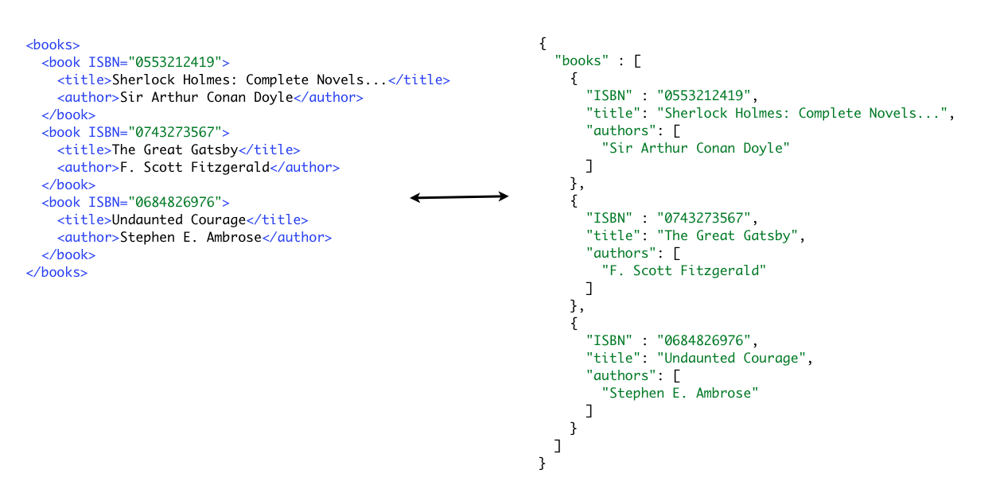

!SLIDE
# Intermediaries #
* Servers which sits between server and client and provides some form of value-add service

.notes Security. transforming, caching (proxies).
Should be illustrated with a drawing.

!SLIDE bullets incremental small
# Intermediary examples #
* Reverse Caching
* Forward Caching
* Pre-lookup of DNS based on links and history of the current client's request history.
* Transforming
* Load-balancing

.notes Transforming: Add a drawing for this.

!SLIDE full-page
# Transforming intermediary #
