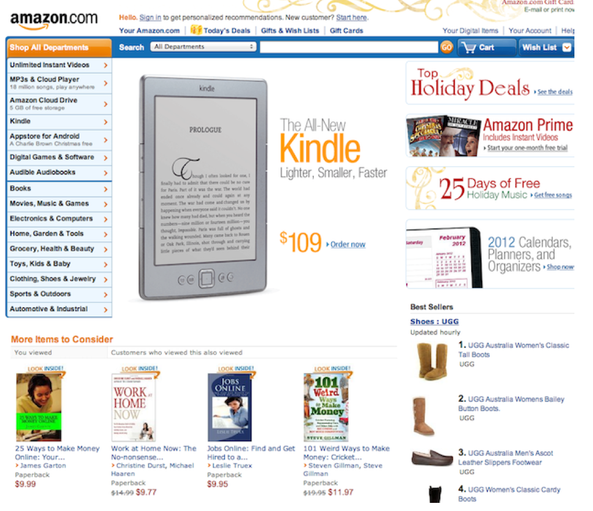
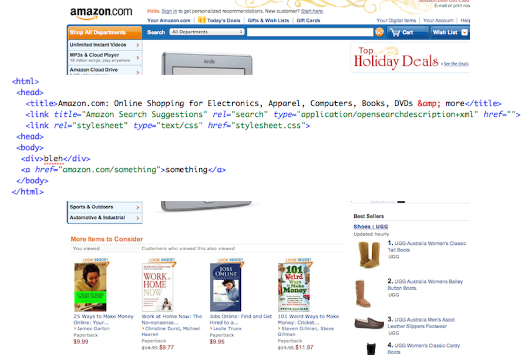

!SLIDE 
# REST #

!SLIDE bullets incremental
# History #

* First Coined by Roy T. Fielding in his dissertation

.notes While developing HTTP/1.1, Fielding also wrote his PhD dissertation. REST is the example in his dissertation.

!SLIDE bullets incremental
# Architectural Styles and the Design of Network-based Software Architectures #
* Describes constraints used to obtain certain properties
* REST
* Pipe And Filter
* RPC

!SLIDE
# Connector #
Software that communicates with the network. Typically a HTTP server, or HTTP Client.

!SLIDE
# Component #
* Server
* Client
* Intermediary

.notes Software which is part of the networked system. Any Piece of software within a restful architecture is
a Component.

!SLIDE
# Resource #

.notes this is what you should think the most of when you are designing a RESTful architecture. 
Think in nouns not verbs. What IS it? Not What can I do with it.

!SLIDE bullets incremental
# Resource #
* Books
* Products
* Articles
* Ads
* Images

!SLIDE bullets incremental
# Representation #
* Encoding of resource state transmitted over the network 
* A Resource MAY have multiple representations
* Hypermedia format
* In HTTP the representation is both the body and the headers of a message (httpbis)

.notes A representation is an encoding of the resource state, served over the network. 
A representation is also known as a hypermedia format or Media Type. 
This will be explained in detail later.

!SLIDE center

!SLIDE center

