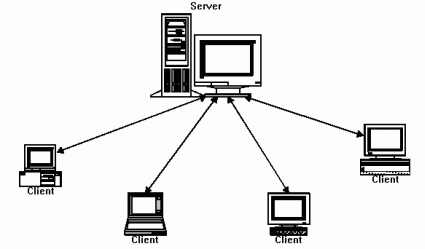

!SLIDE
# Constraints #

!SLIDE center

.notes Client/Server.

!SLIDE bullets incremental
# Uniform Interface #
* Identifying resources using URIs
* Manipulation of resources through representations
* Self-descriptive messaging

.notes The same methods are available everywhere.

!SLIDE
	@@@ java
	interface Resource {
		URI href;
		Response process(Representation r);
		Representation update(Representation r);
		Representation download();
		Response remove();
	}

.notes Example written in Java.

!SLIDE
# Stateless protocol #

.notes Everything that the server needs to satisfy the request must be part of the request.
Authentication, freshness rules, Which resource is being requested, capabilities of the agent.

!SLIDE center

.notes Layered System. Since we are using HTTP, we get this for free.  This means that Components may be injected into the 
network stack to offload origin servers, or add capabilities of their own. For instance Security.

!SLIDE
# Caching #

.notes Important part for scalability. Caches may be placed anywhere in the stack. As we remember 
from the HTTP talk, caching means that polling works fine.

!SLIDE
# Code on Demand (optional) #

.notes An Agent may download additional code to be able to add new capabilities for the Agent.
In browsers this means javascript.
